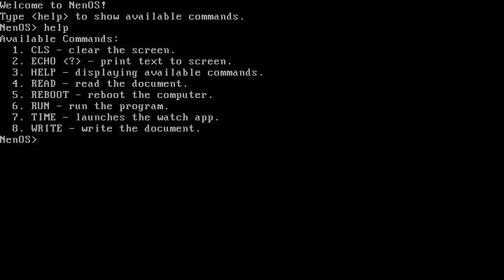

# NenOS

This repository contains files for operating system "NenOS" on assembly language.

## Commands
- CLS - clear the screen.
- HELP - displaying available commands.
- REBOOT - reboot the computer.
- TIME - launches the watch app.

**The commands are written in alphabetical order.**

> The interface is simple and straightforward.

