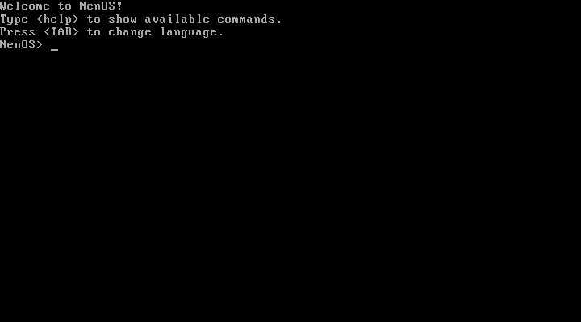

## NenOS
NenOS is an operating system written in NASM assembly language. It runs in real mode (x16) using BIOS interrupts. It has a simple file system and a built‑in assembler. The file system in it works by numbers. For example, READ 1 reads the very first file in the file system.

## Commands
- BUILD &lt;from&gt; &lt;to&gt; - compile the file.
- CALC &lt;sample&gt; - calculate.
- CLEAR &lt;number&gt; - clear the document.
- CLS - clear the screen.
- COPY &lt;from&gt; &lt;to&gt; - copy the document.
- HELP - displaying available commands.
- READ &lt;number&gt; - read the document.
- REBOOT - reboot the computer.
- RUN &lt;number&gt; - run the program.
- TIME - launches the watch app.
- WRITE &lt;number&gt; - write the document.

## Assembler
The built‑in NenOS assembler currently supports only the MOV to AX, BX, CX, DX registers, all interrupts, JMP, RET and the entire syntax of a standard assembler. This allows you to write simple programs using the WRITE command, compile them using the BUILD command, and run them using the RUN command. Code examples:
```
mov al, "!"
mov ah, 0x0e
int 0x10
ret ; return to OS
```
```
mov ah, 0x00
int 0x16
mov ah, 0x0e
int 0x10
jmp 0x9e00 ; loop
```

## Screenshots

